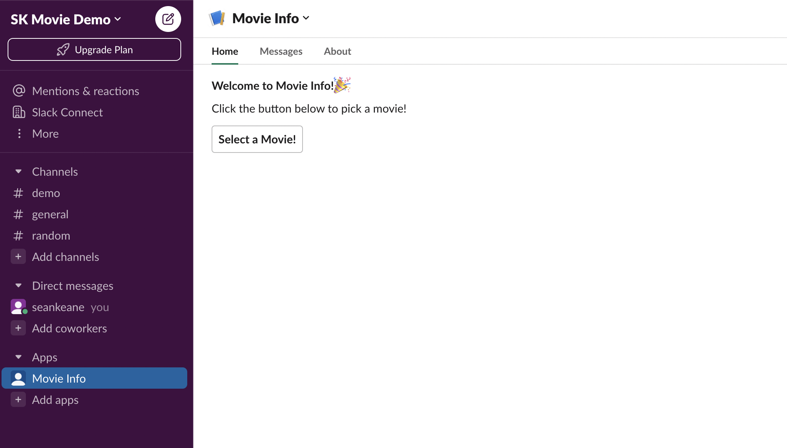
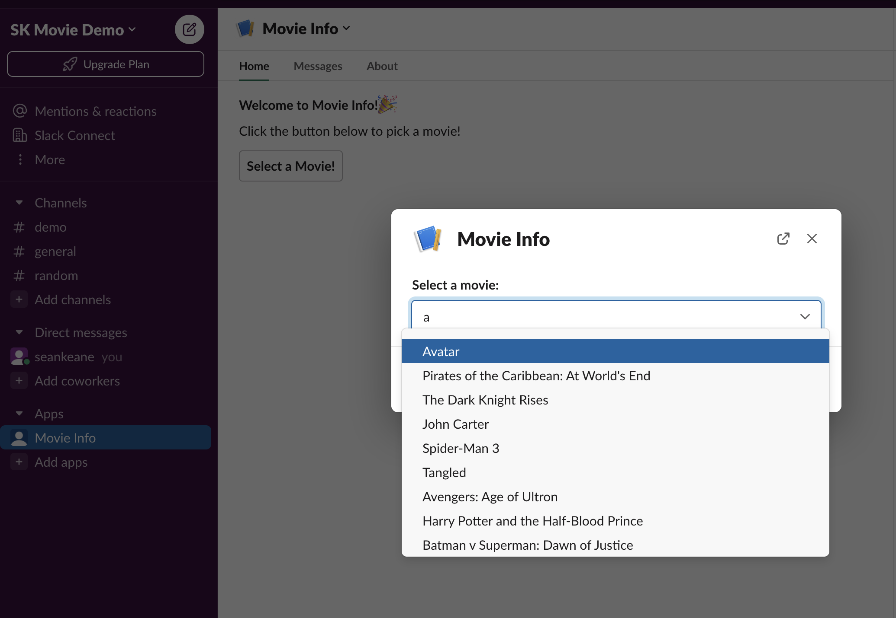
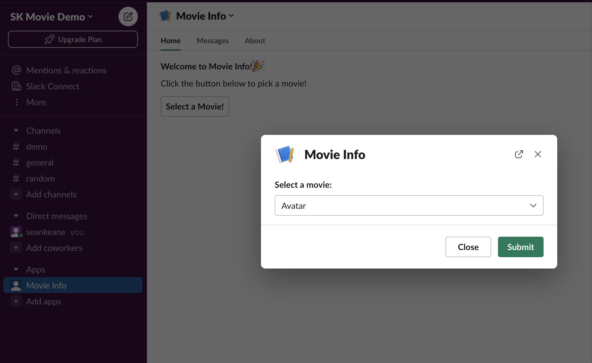
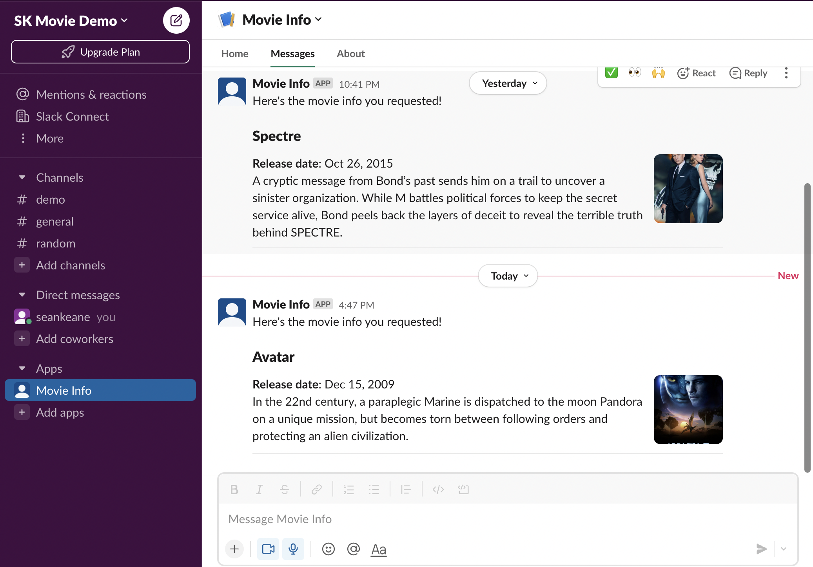

# Slack Movie App Demo
App built for proof of concept demo using Slack Bolt. The app sends users a message via Slack with a summary of information about a movie retrieved from <a href="https://www.themoviedb.org/documentation/api" target="_blank">TMDB API</a>.


### Pre-requisites
- <a href="https://www.themoviedb.org/signup" target="_blank">Join TMDB</a> and request an API Key.
- In your Slack workspace, follow steps in <a href="https://api.slack.com/reference/manifests" target="_blank">Create and configure apps with manifests</a> to create a Slack app from `manifest.yaml` file in this repository and install this to your Slack workspace.
- <a href="https://api.slack.com/reference/manifests" target="_blank">Install ngrok</a> to make node.js service available via public URL.

## Setup
Clone this repository.
### dotenv File
This app uses `dotenv` module to load authentication keys. Create a `.env` file within root directory of project with the following variables:
```
SLACK_SIGNING_SECRET=""
SLACK_BOT_TOKEN=""
MOVIE_DB_AUTH_KEY="
```
- Set `SLACK_SIGNING_SECRET` to the Signing Secret of your Slack app, available on `Settings > Basic Information > App Credentials`.
- Set `SLACK_BOT_TOKEN` to the Bot User OAuth Token setup in your Slack app, available `Features > OAuth & Permissions > OAuth Tokens for Your Workspace`. Note: this token starts with `'xoxb-'`.
- Set `MOVIE_DB_AUTH_KEY` to v3 API key requested after joining TMDB.

### npm 
Open project directory in terminal and run the following:
```bash
npm install

npm run dev
```
This should run the app and return the following text:
```bash
⚡️ Slack Bolt app is running on port 3000!
```
### ngrok 
In a separate terminal, start `ngrok` by running this command in the directory where your `ngrok.exe` file is located:
```bash
ngrok http 3000
```
This should start ngrok and making your app running on port 3000 available via a public URL. The Forwarding URL will be displayed in terminal.

### Slack
Modify your Slack app to referencing your Forwarding URL prepended with `/slack/events` in the following places:
- `Features > Interactivity & Shortcuts > Interactivity > Request URL`
- `Features > Interactivity & Shortcuts > Select Menus > Options Load URL`
- `Features > Event Subscriptions > Enable Events > Request URL`

## Walkthrough

When you click into the app in your Slack Workspace, you will see a greeting and a `Select a Movie!` button:

 

Clicking `Select a Movie!` brings up a modal with a typeahead input. Type a letter to see a list of movies.

 

Selecting a movie from the list and clicking `Submit` triggers request to TMDB to retrieve information about that movie.

 

A message with a summary about the movie is then sent to the user and is available in the Messages tab within the app:

 


 